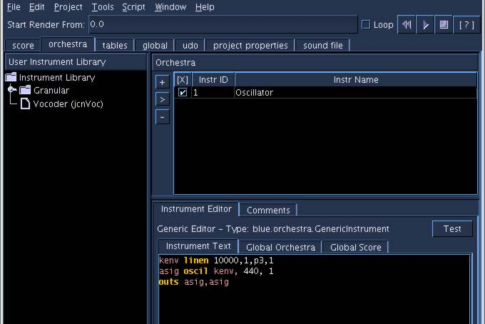
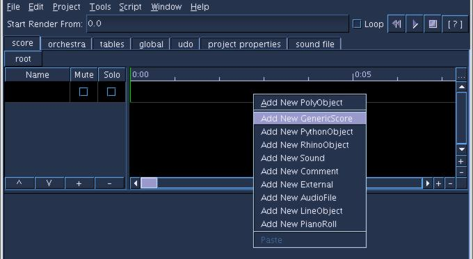
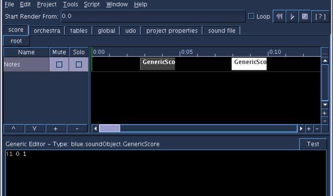
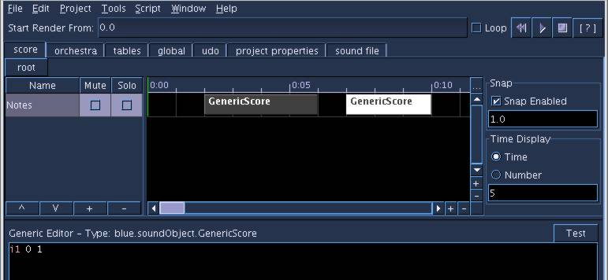

This tutorial will explain how to start using blue. It assumes a little
knowledge of csound, but not too much (If you don't know csound,
understanding Dr. Boulanger's toots at
 should be enough to get you
through this tutorial).

Run blue using the appropriate script provided in the blue/bin
directory. Use the .bat file for windows, the .sh for linux and the
.command file for Mac OS X. If blue is not running check the section
'Installation' on the blue documentation.

We will first create an instrument. Go to the orchestra tab, and click
on the \[+\] button under the 'Orchestra' title. From the pop-menu
select Add Instrument\>GenericInstrument.

Instrument Library

You will want to choose GenericInstrument when you want to create an
ordinary csound instrument. An empty 'untitled' instrument iFs
created. To rename an instrument, select it, press F2 and type the new
name (e.g. 'Oscillator').

The instrument library on the left panel is where instruments are saved
for use in any blue project. To place an instrument in the library so it
is always available, drag it to the Instrument Library folder.

Assigning Instrument to Arrangement

The '\>' button brings an instrument from the library to the project.
To remove an instrument from the project, select it and press '-'.

It is important to understand that instruments which are in the
Instrument Library but not the Arrangement are not available for use in
the csd because they haven't been assigned an instrument id (number or
string, if used as a Csound named instrument).

Now that the instrument is there, we need to define how it will sound.
We use ordinary csound code to do this (since it is a
GenericInstrument). The code for the instrument is written on the lower
right panel, inside the Instrument Text tab within Instrument Editor
tab. Make sure you type the code in this tab, and not the 'Global
Orchestra' or 'Global Score' tabs.

We will create a simple oscillator with an amplitude envelope like this:

    kenv linen 10000,1,p3,1
    asig oscil kenv, 440, gitab
    outs asig,asig

Editing Instrument

Try using blue's autocompletion feature like this: type 'line' and
press ctrl-Space Bar. A pop-up window will display all known opcodes
that begin with line. Once you select 'linen' you will have a template
to fill in the apropriate values.

If you need to remember the syntax for an opcode, place the cursor over
it and press Shift-F1. If you have set correctly the Csound
Documentation Directory, the html help for the opcode will be displayed
if available. See the section 'Installing blue' on the main blue
documentation (F1) for details on setting up the C.D.R.

To define the oscillator table we will use ftgen, and place the
following code in the Global Orc tab for the instrument:

    gitab ftgen 1,0,1024,10,1

Adding an FTable for the Instrument

Placing things like tables in the global tabs inside the instruments
makes it very simple to share instruments between projects, because the
required initialization and tables travel with the instrument.

You can preview the csd file to be generated by using Ctrl-Shift-G or
Project\>Generate CSD to screen. See how the ftgen opcode that was
placed in the Global Orc tab is placed above the instrument definition.

Now that our instrument is ready we will create notes for it. This is
done by going the Score tab (You can use ctrl-1).

The score tab contains horizontal 'tracks' called Sound Layers. On
sound layers you place objects which generate notes that instance the
instruments.

First we will give a name to our sound layer. Simply click on the black
area below 'Name' and type the name (e.g. 'Notes').

To create a note, go to the timeline on the right, and in line with the
sound layer, right-click, and select 'Add New GenericScore'.

Adding a Generic Score

GenericScore allows ordinary csound code to be used, in this case things
like 'i' statements. When you click on the genericScore that has been
created, the bottom panel will show the contents of the object. You can
add as many 'i' statements as you need inside a genericScore Object.
We want our score to generate a note for instrument 1, our
'oscillator' instrument. We'll use the simple:

    i 1 0 1

Editing a Generic Score

You can preview how the object will generate the csound score by
pressing the \[ t e s t \] button on the right side of the panel. Notice
that the start time is the place where the object was placed on the
timeline, but the duration of the note is 2 seconds instead of the 1
second we typed. By default blue creates genericScore objects set to
'scale' the notes inside it. Try dragging the right corner of the
object to make it longer, and try the \[test\] button again. The
duration of the note now scales to the size of the object. Don't forget
that when multiple notes are inside an object, it is the note with the
longest duration that scales to the size of the object and the rest of
the notes are scaled proportionally.

Now let's create a second note a few seconds later. First zoom out by
pressing the '-' button on the right endof the horizontal scroll bar.
Now select the genericScore we have created and press ctrl-C (or
command-C on Mac), and right click where you want to paste the copy and
select 'Paste'. You should now have two objects like in figure 7.

Copying SoundObjects

You can use the snap feature to move the objects by fixed values. press
the \[\...\] button on the upper right corner of the timeline to open
the snap properties. Enable snap to 1 second (Fig. 8). You can also
configure the timeline time display to show numbers instead of time.
This is useful if you set the tempo using a 't' statement, and want
blue to display numbers instead of time values.

Setting Timeline Options

Now move and shape the objects so the first starts at 0, with a duration
of 5 seconds, and the second starts at 10, again with a duration of 5.
It's always good to check using \[test\] to make sure things are how
you want them to be.

Now to produce sound, we will first check the global settings. Go to the
'project properties' tab by pressing ctrl-6. Here you can set the
project's sr, kr and nchnls, and determine the csound executable and
flags.

The main thing to set here is the command line to call csound. The
command line depends entirely on your setup and operating system. In
Linux, csound is usually located in an executable directory, so just
using 'csound' works for most setups. In Windows, you may need to
specify the full path for the location of the csound executable. Note
that after the executable name you can add flags to determine how csound
will process the csd generated by blue. For example, you may want to use
a real-time flag for this project, like -o dac0 or -+P depending on your
system.

An important thing to note here is that when using the play button, the
flags used are the ones inside te command line. The \<CsOptions\> below
only affect the generation of external csd's using the 'Generate CSD
to screen/file' commands from the menu.

When you are ready to compile your csd, press the play button on the
upper right corner or press F9. If you set the output for realtime, you
should hear the tones produced by the oscillator.
