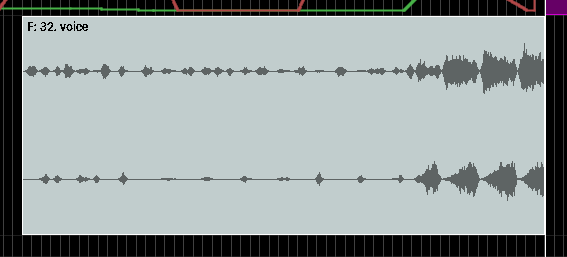

# Sound Object Freezing

## Introduction

Sound Object Freezing allows you to free up CPU-cycles by pre-rendering
soundObjects. Frozen soundObjects can work with global processing
instruments, and files are relative to the directory the project file is
in, so can be moved from computer to computer without problem. Frozen
soundObjects can be unfrozen at anytime, returning the original
soundObject and removing the frozen wave file.



To freeze a soundObject, select one or many soundObjects on the
timeline, rt-click on a selected soundObject, and then select
"Freeze/Unfreeze SoundObjects". To unfreeze, select one or many frozen
soundObjects and select the same menu option.

On the timeline, if your soundObject rendered wave is longer in duration
than the original soundObject's duration (as is the case if you have
reverb processing), the frozen soundObject's bar will graphically show
the difference in times with two different colors.

Note: As currently implemented, when Blue goes to freeze soundObjects it
may appear to be frozen, but messages will continue to appear in the
console showing that csound is rendering the frozen soundObjects. Future
versions will be more polished.

## How SoundObject Freezing Works

1.  An soundObject is selected

2.  Using the same project settings (all of the instruments,
    tables,global orc/sco, etc.) but not scoreTimeline generated sco,
    Blue generates the sco for the selected soundObject and produce a
    temporary .csd file

3.  Blue runs csound with "csound -Wdo freezex.wav tempfile.csd" where
    the x in freezex.wav is an integer, counting up. This wav file is
    generated in the same directory that the projectFile is located.

4.  Blue replaces the soundObject in the timeline with a
    FrozenSoundObject. The FrozenSoundObject keeps a copy of the
    original soundObject (for unfreezing), as well as shows the name of
    the frozen wav file, the original soundObject's duration, and the
    frozen wav file's duration (not necessarily the same, as is the case
    if using global reverb, for example).

5.  When you do a render of the entire piece now, the frozen sound
    object generates a very simple wav playing csound instrument that
    will play the rendered wav file as-is. The instrument looks
    something like:
    
    ```csound-orc 
    aout1, aout2    diskin    p4         
                    outs      aout1, aout2 
              
    ```
    
    and the FrozenSoundObject only generates a single note that has the
    start-time, the duration of the frozen wav file, and the name of the
    file. This will end up playing the soundFile exactly as if the SCO
    for the original soundObject was generated. This also bypasses any
    routing to global sound processing, as if you had any of these
    effects originally, the would be generated as part of the frozen
    file.

## Notes

  - You can select multiple soundObjects and batch freeze and unfreeze
    -the generated wav file may be longer than the original soundObject,
    due to global processing instruments (like reverb, echo, etc.) This
    is taken into account.

  - The freezing system does \*not\* work for all graph topologies. If
    you're using soundObjects with instruments used as control signals,
    this won't work unless the notes for the instruments they are
    controlling are also in the same soundObject. I.e. I have one
    soundObject that has only notes that affect global variables, while
    I have one instrument that uses those global variables. This could
    work though if you repackage the set of soundObjects into a
    polyObject. Probably best to generalize as:
    
      - Your soundObject must be self-contained
    
      - All sound output from instruments go directly out or piped
        through always-on instruments, that most likely should take
        advantage of the <total\_dur\> variable, as well as the new
        <processing\_start\> variable (more about this when I release,
        but together with freezing, this lets you set the start time of
        always-on instruments to the first time where non-frozen
        soundObjects occur, so if the first half of your piece is frozen
        and you're unfrozen stuff is in the second half, you don't need
        always on instruments to be turned on until the second half as
        the first half is routed to outs

  - This system is tested with 2-channel pieces. I'm not sure if this
    will work with higher number of channels, but I don't see why it
    wouldn't.

  - Changing the number of channels on the project after a freeze may
    cause Csound errors when rendering the frozen soundObject (can be
    remedied by unfreezing and refreezing)

  - Frozen files are referenced relatively to the project file, so you
    are free to move your project directory around or rename it and the
    frozen files will work fine.

  - Freezing SoundObjects uses the same settings as found in the
    project's Disk Render settings (e.g., sr, ksmps, 0dbfs).
