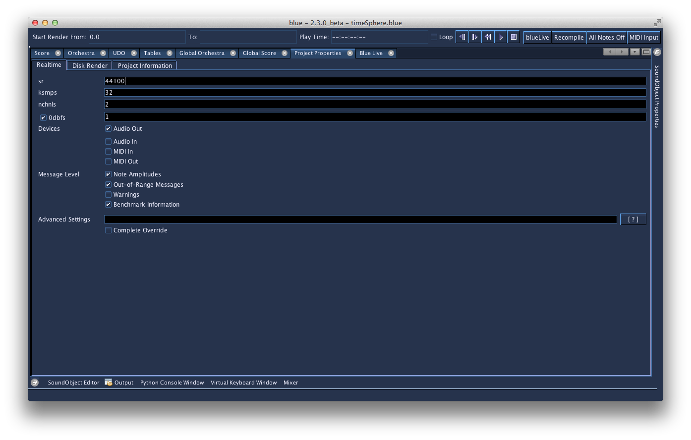

# Project Properties

Project Properties



  - sr  
    sr to use when rendering in real-time. Value defaults to value set
    in Program Options.

  - ksmps  
    ksmps to use when rendering in real-time. Value defaults to value
    set in Program Options.

  - nchnls  
    nchnls to use when rendering in real-time. Value defaults to value
    set in Program Options.

  - 0dbfs  
    The checkbox sets whether 0dbfs is used at all in the project. If
    enabled, the value will be assigned to the value in the textfield.
    The default for the value is set ing Program Options, as well as if
    0dbfs is enabled by default or not.

  - Devices  
    Devices to use when rendering in real-time (Audio In/Out, MIDI
    In/Out). The value of the device is dependent on the values set on
    the Program Options. By delegating the value to use to what is set
    on the Program Options, the project does not have to store settings
    which are hardware dependent, so projects can be easily moved from
    one computer to the next.
    
    For example, if your project is set to use "Audio Out", one system
    may use a value of "-+rtaudio=alsa -o dac:hw:0,0" while another
    system may use a value of "-+rtaudio=winmme -o dac2". The project
    only needs to be set to use "Audio Out" and when the project goes to
    render, the settings set for that system's audio out will be used.

  - Message Level  
    Enables what kind of messages Csound should report. The values
    default to what is set in Program Options.

  - Advanced Settings  
    Extra flags to append to the commandline that might not be covered
    by options in the UI. Pressing the \[?\] button will open the
    documentation for the Csound command flags.
    
    If "Complete Override" is enabled, the value given in the "Advanced
    Settings" textbox will be used as given and no other values set from
    the UI will be used. Projects prior to 0.106.0 will have their
    commandline settings copied to here and the "Complete Override"
    section will be enabled. When this setting is enabled, the
    commandline should set the call to the Csound executable to use and
    the flags to use but with the name of the CSD left out as it will
    automatically be appended to by Blue. An example of a commandline to
    use here with "Complete Override" is:
    
    ``` 
                csound -Wdo dac
              
    ```

<!-- end list -->

  - sr  
    sr to use when rendering to disk. Value defaults to value set in
    Program Options.

  - ksmps  
    ksmps to use when rendering to disk. Value defaults to value set in
    Program Options.

  - nchnls  
    nchnls to use when rendering to disk. Value defaults to value set in
    Program Options.

  - 0dbfs  
    The checkbox sets whether 0dbfs is used at all in the project when
    rendering to disk. If enabled, the value will be assigned to the
    value in the textfield. The default for the value is set ing Program
    Options, as well as if 0dbfs is enabled by default or not.

  - Filename  
    Name to use for the rendered sound file. If a value is not given,
    Blue will ask on each render what to name the file and where to
    render it to.
    
    If the "Ask on Render" is enabled, Blue will always ask on each
    render what to name the file and where to render it to. This is
    useful to enable if temporarily rendering parts of a project or if
    the project is only meant to be used to render small sound samples.

  - Message Level  
    Enables what kind of messages Csound should report. The values
    default to what is set in Program Options.

  - Advanced Settings  
    Extra flags to append to the commandline that might not be covered
    by options in the UI. Pressing the \[?\] button will open the
    documentation for the Csound command flags.
    
    If "Complete Override" is enabled, the value given in the "Advanced
    Settings" textbox will be used as given and no other values set from
    the UI will be used. Projects prior to 0.106.0 will have their
    commandline settings copied to here and the "Complete Override"
    section will be enabled. When this setting is enabled, the
    commandline should set the call to the Csound executable to use and
    the flags to use but with the name of the CSD left out as it will
    automatically be appended to by Blue. An example of a commandline to
    use here with "Complete Override" is:
    
    ``` 
                csound -Wdo mySoundFile.wav
              
    ```

<!-- end list -->

  - Title  
    Title for this project. For general information purposes; is also
    used when generating header comments in CSD.

  - Author  
    Author for this project. Defaults to value set in Program Options.
    For general information purposes; is also used when generating
    header comments in CSD.

  - Notes  
    Notes for this project. For general information purposes; is also
    used when generating header comments in CSD.
