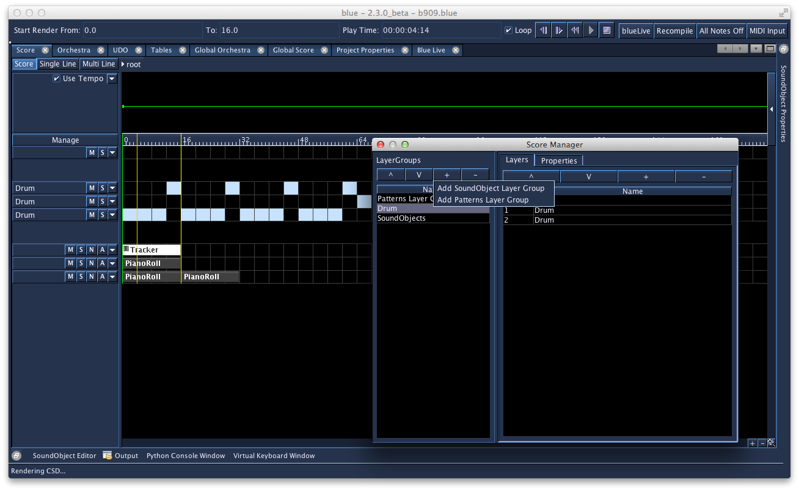
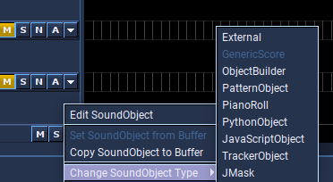
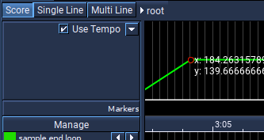
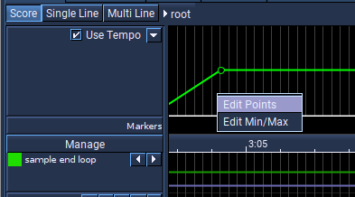
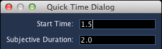
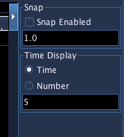

# Score Timeline

## Overview

The Score is the tool in Blue for working with musical material in time.
It is a canvas upon which to create and organize musical ideas. The
Score features a modular timeline, where each [Layer
Group](#layer_groups) within the Score is a module. These modules are a
plug-in point that can be extended with other plug-ins. Each Layer Group
in turn may be broken down into layers.

The image above shows a Score with three Layer Groups. The first two are
Patterns LayerGroups, while the last is a SoundObject Layer Group. Also
shown is the ScoreManager dialog (accessible from the Manage button on
the left part of the Score).

## Layer Groups

A Score is divided into Layer Groups. Each Layer Group has a
user-interface for the main timeline area, as well as a header interface
that shows on the left-hand side. The header area usually shows
meta-information and controls for each of the Layer Group's layers, such
as layer name, muting, soloing, and other features.

By using the Score Manager Dialog, you can add as many Layer Groups as
you like, as well as many layers to each group as you like. You can also
push up and down Layer Groups to reorganize them. The same
add/remove/push up/push down actions are also available for Layers
within a Layer Group.

!!! note
    Add/Remove/Push Up/Push Down for layers is also available while working
    in the main score area by right-clicking the Layer panels on the right
    and selecting the options from the popup menu.

Also, all LayerGroups support having [NoteProcessors](../../../reference/noteProcessors/top)
used with them. Using a NoteProcessor on a LayerGroup will affect all
notes generated within that LayerGroup. Editing the LayerGroup's
NoteProcessors can be done by right clicking on the root Score node in
the [Score Bar](#score_bar), described below.

More information on the different NoteProcessor can be found 
[here](../../../reference/noteProcessors).

Regarding the design, a Layer Group is primarily responsible for
generating Csound Score notes. However, they are also able to generate
tables, instruments, and anything else that is usable in Csound. It is
up to the developer to choose what features the Layer Group will use.

### SoundObject 

SoundObject Layer Groups are one of the primary Layer Group types. They
support the SoundObject system in Blue for scoring them in time on the
timeline. They also are the canvas on which
[automations](../../../concepts/parameterAutomation) are drawn.

SoundObject Layer Groups are divided into SoundLayers. Each SoundLayer
can contain SoundObjects of any type as well as have automations
assigned to the layer. Unlike MIDI-based studio software, where layers
are bound to a single instrument or channel in a mixer, Blue's
SoundLayers are free to hold SoundObjects that generate any data for any
instrument. This design choice allows freedoms for you to design your
project as you wish, though at the expense of being able to implement
some things which may be commonly found in MIDI-based studio software.

To use the SoundObject system, first create a SoundObject Layer Group
using the Score Manager Dialog. (By default, new projects in Blue start
with a single SoundObject Layer Group.) Next, add as many layers as you
would like to the LayerGroup. You can then edit the names of the layers
using the ScoreManager Dialog, or back in the main Score area by
double-clicking the area on the left of the Layer's panel on the left.

More information on the different SoundObjects can be found 
[here](../../../reference/soundObjects).

On the timeline, rt-clicking on any soundLayer will show menu options
for adding different types of SoundObjects, pasting a SoundObject from
the buffer if any SoundObjects in the buffer are available, as well as
other commands. (Copying and pasting of SoundObjects can also be done
using ctrl-c and ctrl-click on a layer.)

Once you have SoundObjects on the timeline, you can click on them to
select it, or click in an empty area and drag to show a selection
rectangle. You can also add and remove SoundObjects to/from the
selectionn by holding shift when clicking.

Once selected, you can move selected SoundObjects by pressing the mouse
down on one of the selected SoundObjects, then drag to move them in time
as well as up and down layers. If you press shift down when you click,
once you drag you will create clones of the original material and move
them in time. If you move the mouse to the right-side of a SoundObject,
the cursor will change to a resize cursor, and clicking and dragging
will allow you to change the duration of the SoundObject. (Note you can
only resize one SoundObject at a time.)

If you have a single SoundObject selected, you can edit the properties
of the SoundObject by using the SoundObject Property Window. This window
can be opened from the menu "Windows -\> Sound Object Properties" or by
using the shortcut "F3". From this window you can change the name of the
SoundObject, its start time and subjective duration, as well as add and
remove NoteProcessors (if the SoundObject supports it).

To edit a SoundObject, select a single SoundObject and open the
SoundObject Editor window. You can also double-click a SoundObject,
which will set the editor for the SoundObject in the Editor window as
well as focus the SoundObject Editor window. (If the Editor window is
docked, double-clicking the SoundObject will cause the editor to show
the docked window.)

### Patterns

Patterns Layer Groups are based upon the same SoundObject system as the
SoundObject Layer Groups, but presents a different way to working with
these objects. At a high-level, each Pattern layer has one SoundObject
assigned to it. The SoundObject is the source score material for a
Pattern Layer. Selecting boxes in the grid that shows for the Patter
Layer determines where that score material will be used to generate
notes. For music projects that rely on patterns and regular metered
time, using the Pattern Layer Groups can be more efficient for creating
a piece than using SoundObject Layer Groups.

The grid of time for Pattern Layers is currently hardcoded to repeat
every four beats, or one measure at 4/4 time. However, a SoundObject is
not constrained to generate score for only one measure. For example, you
can create a PianoRoll that has a time behavior of "None", and have it
last sixteen beats (four measures). Everywhere that the pattern grid is
selected for the Pattern Layer that uses that SoundObject will then
create that sixteen beat score and start it at the time of the grid box.

Patterns Layer Menu Options

By default, new Pattern Layers will use a GenericScore SoundObject that
is set to a duration of four beats, and use a time behavior of "None".
This means that the score will generate "as-is". In the layer's popup
menu options, you can replace the SoundObject that is being used for the
layer with one from the SoundObject buffer (i.e. copied from BlueLive or
from a SoundObject Layer). Also, you can switch to a different type of
SoundObject using the menu.

SoundObjects will generate accordingly to the values set in the
SoundObject Properties dialog, with the exception of the start time.
Blue will reassign the start time to 0 when it generates the notes for
the layer. On the whole this behavior will not affect most users, but is
worth noting.

To edit the SoundObject for a Pattern Layer, you can either use the
popup menu option for "Edit SoundObject", or you can also click the
layer panel on the left. A single click will bring up the SoundObject
editor.

To edit the layer's patterns, click on a grid box to toggle between on
and off for that box. You can also press down and drag along to set
multiple boxes. The value that is set for the multiple boxes will depend
on the action of the first box selected. For example, if the first box
when the initial mouse down is on, the mouse down will turn it off, and
dragging will turn off all boxes that the mouse extends through.

### Audio 

Audio Layer Groups provide standard Digital Audio Workstation (DAW)
functionality. Users can use Audio Layers to drag-and-drop Audio files
onto the timeline. Each Audio Layer maps to a channel in Blue's mixer,
where effects can be added for the audio layer. Automation for effect
parameters is available on the audio layer.

To use the Audio layers, first create an Audio Layer Group using the
Score Manager Dialog. Next, add as many layers as you would like to the
LayerGroup. You can then edit the names of the layers using the
ScoreManager Dialog, or back in the main Score area by double-clicking
the area on the left of the Layer's panel on the left. The name of the
Audio layer will also show under its corresponding mixer channel.

To add Audio files to a layer, you can either drag and drop a file from
the operating system's file mananger, or you can use the Blue File
Manager to locate a file, then drag and drop it to an Audio layer.

Once an audio clip is on the timeline, you can modify its properties in
a few ways. First, you can click and drag it to move it in time. If you
click and drag from the left hand side, you will alter both the audio
clip's start time, as well as the audio clip's file start time. For
example, if a clip was added that started at time 0.0 and had an audio
file start of 0.0, if you drag from the left hand side to time 3.0, both
the start of the clip and audio file start will be set to 3.0. This
means that 3.0 beats into the project, the audio clip will start
rendering from 3.0 seconds into the file. If you drag from the right
hand side, it will alter the duration of the audio clip. If you hold
down alt+shift, then press within an AudioClip, you will split the
AudioClip into parts. If you hold down the alt key, then press and drag
the mouse, you can alter just the file start time.

If you have a single Audio clip selected, you can edit the properties of
the clip by using the ScoreObject Property Window. This window can be
opened from the menu "Windows -\> Sound Object Properties" or by using
the shortcut "F3".

Additionally, if a single Audio clip is selected, additional properties
are available to edit using the ScoreObject Editor window. You can also
double-click an Audio clip, which will set the editor for the clip in
the Editor window as well as focus the ScoreObject Editor window. (If
the Editor window is docked, double-clicking the clip will cause the
editor to show the docked window.)

Audio clips support fades. Like Ardour, upon which much of the audio
layer system is based, all fades are crossfades. Clips will crossfade
with signals that are already in the bus, with the first clip
crossfading with silence. Fade types and durations may be set within the
clip's editor panel. The clip duration may be visually modified by
mousing over the clip, pressing with the mouse on either the fade-in or
fade-out handle that appears after mousing over the clip, then dragging
and releasing to update the fade's duration. The fade type may also be
modified by right clicking within a fade area and choosing the fade type
using the popup menu.

For more information about Fades, please see Ardour's manual entry on
[Region Fades and
Crossfades](http://manual.ardour.org/editing-and-arranging/create-region-fades-and-crossfades/).

## User-Interface Walkthrough

### Play Bar

The play bar at the top has:

  - time to start playing from
  - what time to play to (if the render end time is set)
  - the current play time
  - Loop checkbox to have render looping from render start time to
    render end time
  - Forward/Back buttons for jumping between markers
  - Back button to start from beginning of Score
  - Play/Stop buttons to start/stop rendering
  - BlueLive buttons:
      - BlueLive toggle button to turn on/off BlueLive
      - Recompile button that will stop the current BlueLive run,
        recompile the project, and start BlueLive again
      - All Notes Off Button to turn off any hanging notes in a BlueLive
        run
      - MIDI Input toggle button enabled/disables Blue MIDI input into
        BlueLive

### Score Bar

The PolyObject bar (shown above with only one PolyObject, "root") shows
what PolyObject you are currently editing. if you were to add a
PolyObject named "phrase 1" to the main timeline shown above, then
double click that PolyObject to edit it, the PolyObject bar would have
two buttons on it, one for "root", and one for "phrase 1". you would
then be editing "phrase 1"'s timeline. by clicking on the "root" button
of the timeline, you would then return out of the PolyObject's timeline
and back in the root's timeline.

### SoundLayer Editor

Below the polyObject bar on the left, you will see the soundLayer
editor. here you can change the name of the soundLayer, as well as mute
the layer (all soundObject's on muted layers will not be used to
generate notes when creating .CSD files).

On the bottom of the soundLayer editor are four buttons, "^", "V", "+",
and "-". "^" and "V" will push up or push down soundLayers. (HINT: You
can move multiple soundLayers by clicking on one soundLayer, then
holding down shift and clicking on the last of the soundLayers you want
to move, then using the "^" and "V" buttons.) the "+" will add a
soundLayer after the currently selected soundLayer. if no soundLayers
are selected, then it will add one to the end of the list. the "-"
button will remove any selected soundLayers. it should ask for a
confirmation before removing any layers.

### The Timeline

Below the polyObject bar on the right is the main time line. it shows
the time line for the currently edited polyObject. The +/- buttons next
to the scrollbars are used to zoom in on the time line, and those
settings will be maintained between work sessions.

### Tempo Editor

The tempo editor is an optional use feature that allows editing of
overall tempo for a project using a line editor. This feature starts off
as disabled and closed. When in this state, whatever tempo values are
saved will show as dark gray line that is uneditable. To enable the use
of the tempo editor, select the checkbox marked "Use Tempo". Selecting
this will redraw the tempo line in green. To open up the tempo editor
for a larger view and for editing, select the down arrow button next to
the "Use Tempo" checkbox.

Like other line editor objects in Blue, left-clicking on an area where
there is no point will insert a new point, while hovering over an
existing point and pressing down, then dragging will allow moving of
that point. Right-clicking a point will delete a point.

If right-clicking the tempo editor when not on a point, the following
popup menu will appear:

The first option will allow editing of the values of the points entered
into the line editor by use of a table with two columns: the first
column being the beat on which the tempo change occurs and the right
column being the tempo value that it should have. One may find using the
table editor easier to use to fine-tune values.

The second option will allow changing the boundary min and max tempo
values for the line editor, as well as the option for what to do for
points that fall outside of the new range. The options here are
"Truncate" which will set any points' values that lie outside the new
range to the closest boundary value, or "Scale" which will take all
point values from the old range and scale them to the new range.

Use of the tempo editor is completely optional and users familiar with
Csound's t-statement for controlling global tempo may opt to disable
using Blue's tempo editor and to use a t-statement in the global orc
section of the globals tab. Also, older Blue projects that existed from
before Blue's tempo editor was developed can count on their projects
loading and running correctly even if opened with versions of Blue that
do have a tempo editor, due to Blue's default to disable the Blue tempo
editor. Regardless of which tempo system is chosen by the user, one
should be careful not to use both at the same time as this will cause
two t-statements to exist in the generated CSD (the hand-entered one and
the one generated by Blue), causing unexpected performance results.

### Quick Time Dialog

While in the main timeline area, pressing ctrl-t when a soundObject is
selected will bring up the quick time dialog. Here you can edit the
start time and duration of the currently selected soundObject. When the
dialog is first popped up the start time field is automatically focused
for editing. You can press tab to switch between the two fields.
Pressing enter will update the properties. Pressing escape, closing the
dialog, or clicking anywhere outside of the dialog will cancel any
changes and close the dialog.

### Score Time Properties

In the upper right of the Score window is an arrow button; pressing this
reveals the time properties for the Score. The two options here are Snap
and Time Display. Snap provides a grid by which to line up your
SoundObjects. Snap is measured in beats. Time Display allows setting how
the time bar shows numbers, i.e. every 4 beats, rendered as a number or
as a time value.

### Shortcuts for SoundObject Layer Groups

| Shortcuts    | Description                                                                                                                                                                                                 |
| ------------ | ----------------------------------------------------------------------------------------------------------------------------------------------------------------------------------------------------------- |
| ctrl-c       | copy selected soundObject(s)                                                                                                                                                                                |
| ctrl-x       | cut selected soundObject(s)                                                                                                                                                                                 |
| ctrl-click   | paste soundObject(s) from buffer where clicked                                                                                                                                                              |
| shift-click  | paste soundObject(s) from buffer as a PolyObject where clicked                                                                                                                                              |
| shift-click  | when selecting soundObjects, adds soundObject to selected if not currently selected and vice-versa                                                                                                          |
| double-click | if selecting on timeline, select all soundObjects on layer where mouse clicked                                                                                                                              |
| ctrl-d       | duplicate selected SoundObjects and place immediately after the originals                                                                                                                                   |
| ctrl-r       | repeat selected SoundObjects by copying and placing one after the other n number of times where n is a number value entered by the user (user is prompted with a dialog to enter number of times to repeat) |
| ctrl-drag    | if ctrl is held down when drag is initiated of selected SoundObjects, a copy of the originals is made and left at their original times                                                                      |
| ctrl-t       | show quick time dialog of selected soundObject                                                                                                                                                              |
| 1            | switch to Score mode                                                                                                                                                                                        |
| 2            | switch to Single Line mode                                                                                                                                                                                  |
| 3            | switch to Multi Line mode                                                                                                                                                                                   |
| space        | Start/stop rendering of project                                                                                                                                                                             |
| space        |                                                                                                                                                                                                             |
| G            | Scroll score view to location of render start time (green line)                                                                                                                                             |
| Y            | Scroll score view to location of render end time (yellow line)                                                                                                                                              |
| Alt-S        | Toggle Snap                                                                                                                                                                                                 |
| \[           | Set render start time to previous marker (or beginning of project) and scroll view to new time                                                                                                              |
| \]           | Set render start time to next marker (or end of project) and scroll view to new time                                                                                                                        |
