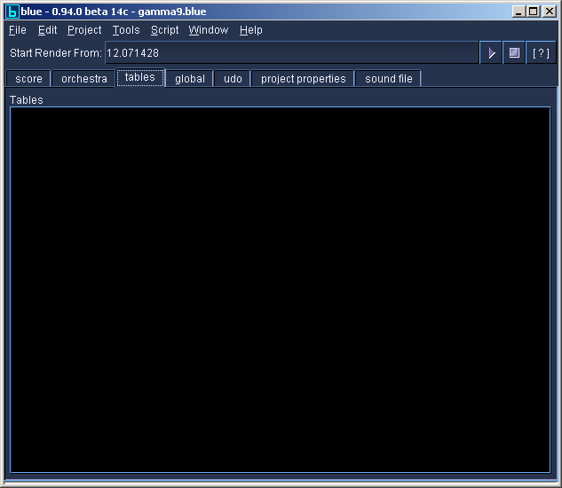

# Tables Manager

The tables manager contains a text area for global ftables. Table
statements put here will be immediately inserted above i-statements of
the <CsScore\> area of the generated CSD file.
