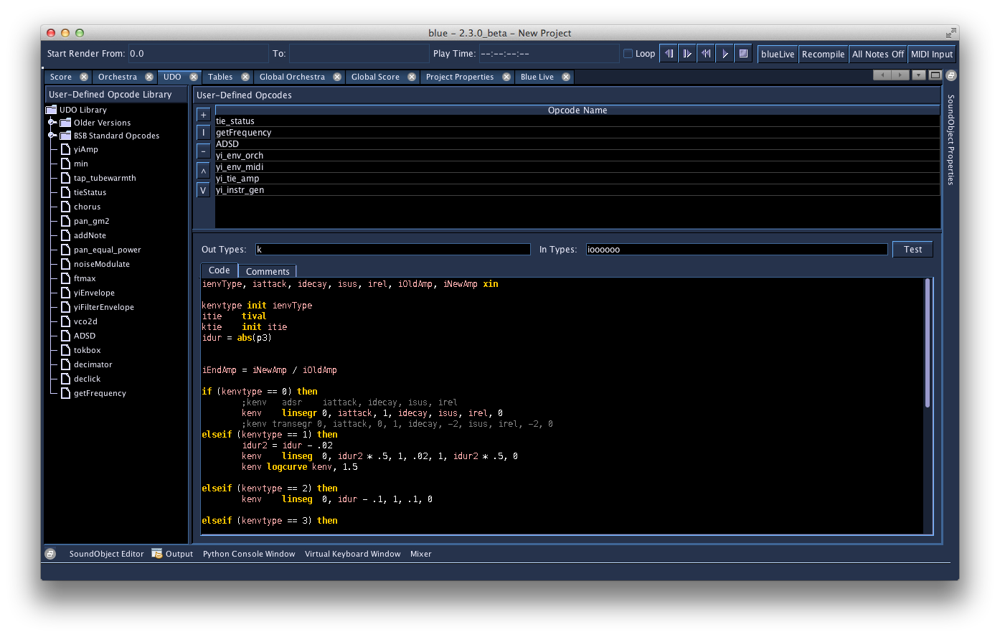
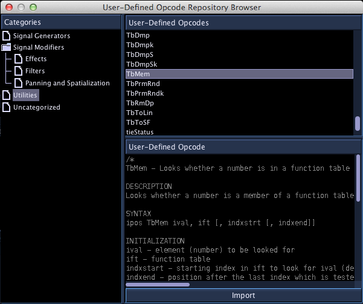

# User-Defined Opcodes Manager

The User-Defined Opcodes Manager contains three main parts:

  - Program-wide User-Defined Opcode Library
  - UDO list for Project-wide UDO's
  - UDO Editor

The program-wide UDO library is where you can manage your entire library
of UDO's. Right-clicking on the tree allows adding and removing groups,
as well as adding and removing UDO's. You can also drag UDO's into the
library from the project-wide UDO list, or paste them using the popup
menu. Clicking on a UDO in the library will populate the UDO Editor, and
a green border will be shown to highlight that you are editing the
library copy of the UDO.

The project-wide UDO list contains what UDO's are available for your
project. Since UDO's can be embedded into Blue instruments, it is
usually better to do so so that an instrument is encapsulated and
copying the instrument will include all of its UDO's it depends on.
However, using the project-wide UDO list can be useful when creating a
new project and multiple new instrument designs might be using a
developing UDO.

UDO's can be created in the project-wide list by using the "+" button,
and removed by using the "-" button to the left the table on top. UDO's
can also be dragged into this list from the library. You can also drag
in a folder of UDO's from the library into this list, or copy/paste them
using the popup menu. Dragging a folder is useful if you have a set of
UDO's you commonly use in all of your instrument designs.

As UDO's may depend on other UDO's, the order in which they are
generated can be significant. The UDO's in the table are generated from
top-down. To shift the order of the opcodes up and down, select an
opcode in the table and use the "^" and "V" buttons to push up and push
down.

| Shortcuts    | Description                                                                                                                                                                                                 |
| ------------ | ----------------------------------------------------------------------------------------------------------------------------------------------------------------------------------------------------------- 
| +           |add a blueUDO or a regular (Csound)UDO                                                                                                                                                                                   |
| I            |import a blueUDO or a regulaer (Csound) UDO                                                                                                                                                                                   |
| -           |remove selected blueUDO or regular (Csound) UDO                                                                                                                                                                                  |
| ^            |push UDO up                                                                                                                                                                                   |
| V           |push UDO down                                                                                                                                                                                   |

Two types of UDO's may be imported or exported: the blueUDO and the regular 
Csound UDO. The blueUDO has the option of adding comments and information
in a separate tab.

To edit the UDO, select one from the table. After selecting a UDO, the
UDO Editor will be populated with that UDO. This time, no green border
will show, as that is only done when a Library UDO is being edited.

## Notes on Editing UDOs

For UDO's, you will need the name of the UDO, the intypes and outtypes,
and the body of the code itself. For the body of the code, you will not
need anything from the "opcode" line that normally starts a UDO
definition (i.e. "opcode myOpcode, a, ak"), as those should be in the
text fields for Opcode Name, In Types, and Out Types, and you will not
need an "endop", as Blue will add that itself.

## A few places to find UDOs

These are a few places where you may find UDO's:

  - http://juliencoder.de/sound/index.html (JeanetteC)
  - https://github.com/tjingboem/UDOs (Menno Knevel)
  - https://github.com/csudo/csudo (Csound community)
  - http://iainmccurdy.org/csound.html (Iain McCurdy)
  - https://github.com/kunstmusik/libsyi (Steven Yi)

<!-- 

TODO - add documentation on Importing Blue or Csound UDOs

## User-Defined Opcode Repository Browser

Using the "I" Button will open up the UDO Repository browser. The
browser shows the available UDO's in the repository on Csounds.com and
allows for importing from the repository straight into your project. -->
