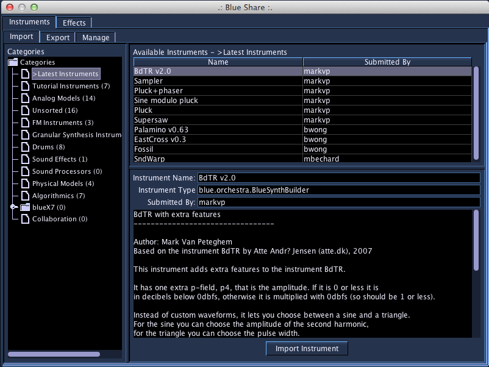

# BlueShare

BlueShare is an online, in-program way to share instruments, effects,
and SoundObjects with other Blue users. BlueShare does not require a
user account to download items, but does require one for uploading. If
you would like to share an instrument or effect, please sign up for an
account at <http://blue.kunstmusik.com>

To use BlueShare, go to the Tools menu to open it up. Blue will contact
the server to get a list of Instrument, Effects, and SoundObjects
available. From there, you can browse categories, then select an item in
the upper-right table to get more information. Once you find something
you are interested to try, select "Import Instrument", "Import Effect",
or "Import SoundObject". Blue will download the instrument, effect, or
SoundObject into the User Instrument Library, Effects Library, or User
SoundObject Library in a folder called "Imported Instruments", "Imported
Effects", or "Import SoundObjects".

To upload and instrument or effect, switch to the Export tab. From there
you will see a place to enter your username and password, a listing of
instruments, effects, or SoundObjects from your libraries, a tree of
categories to use for uploading, and a description box (pre-populated
with the Comments field of your Instrument or Effect). You can then
press the "Submit" button to send it to the server.

The manage tab allows you to pull down a list of your contributed
instruments, effects, and SoundObjects. You can then remove the item
from BlueShare using "Remove" button.
