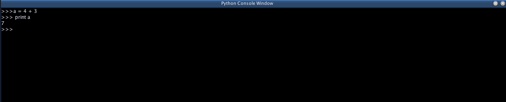

# Python Console

Python Console

The Python Console allows you to interactively write and execute python
code using the Jython interpreter built in to Blue. Because Blue does
not clear the environment of the interpreter between runs, the console
can be useful to interactively inspect objects. Some ways you might use
the console:

  - Use
    dir()
    to inspect objects to see what methods and members they have
  - Use
    help()
    to view the documentation on an object or class.
  - After generating a score or using the "Test" button on a
    PythonObject, you can interactively test functions you have written
    by calling it using code in the console.
  - Practice your python coding live.

The console works much like running python interactively in a console or
terminal. At the "\>" prompt, you can type in some code, then press
enter to execute the code. All output from python functions (including
things like print statements in PythonObjects in the Score or Python
NoteProcessors) will output to the Python Console.

Some useful shortcuts available while in the console:

| Shortcuts         | Description                                                    |
| ----------------- | -------------------------------------------------------------- |
| ctrl-up/ctrl-down | cycle through previous commands used                           |
| ctrl-l            | clear the console (also available from the rt-click popup menu |

Shortcuts for the Python Console
