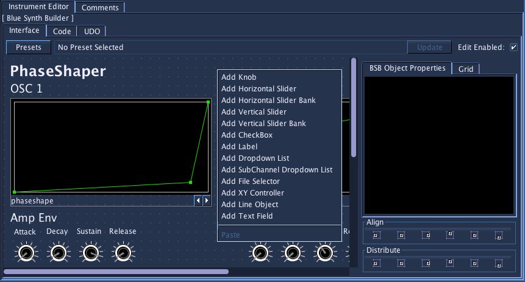
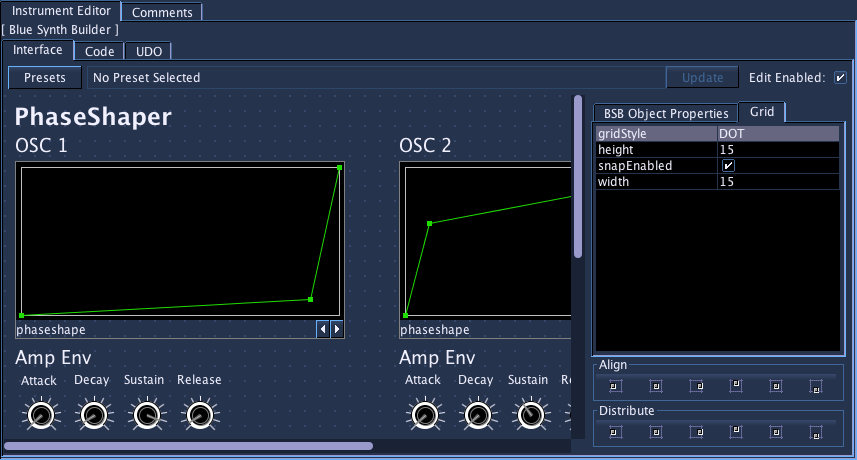

# BlueSynthBuilder

## Introduction

BlueSynthBuilder (BSB) allows the user to graphically build instrument
interfaces for their Csound instruments. The graphical interface is
designed for the use of exploring configuration of an instrument as well
as adjustment to values in realtime (requires enabling using the Csound
API, see [here](../../../gettingStarted/installation#using_blue_with_the_csound_api).

## About BlueSynthBuilder

### Principles of Design

It has been my experience that most Csound instruments tend to be
limited in user configurability of parameters than commercial
synthesizer counterparts. It is my belief that a large part of that is
due to the text-based nature of instruments. I've found that:

  - Modular instruments are easier to express connections of modules via
    text or code rather than visual paradigms (patch cables, line
    connections), and thus easier to create the instrument by text

  - Graphical elements, however, excel in relaying information about the
    configuration of the instrument to the user and also invite
    experimentation, while text-based configuration of instruments is
    often more difficult to quickly understand the parameters settings
    and limits

###  Hybrid Design

Going completely graphical for the building of instruments, in the case
of systems like Max/PD/jMax or Reaktor, I've found that the instrument's
design no longer become apparent when viewing complicated patches. On
the other hand, using completely textual systems such as Csound or C++
coding, the design of the instrument has a degree of transparency, while
the configuration of the parameters of the instrument becomes difficult
to understand and invites less exploration.

Using systems like MacCsound's widgets or Blue's BlueSynthBuilder, one
is able to use graphical elements where they excel, in showing
configuration of an instrument and for manipulation of values, while
using textual elements where they excel, in the design of instruments
and expressing the connections between modules.

I have found that this sort of hybrid design offers the best of both
worlds and when I am spending time building and using new instruments, I
can quickly design an instrument and also explore the parameters of an
instrument's design by using BlueSynthBuilder.

## Using BlueSynthBuilder

BlueSynthBuilder is divided up into three tabs, each of which handles
the different concerns of the instrument builder. Also, the process of
creating instruments and using instruments is also split between
*edit*and *usage* modes. Instrument builders will tend to use both
modes, while users of BSB instruments may not ever have to touch a line
of Csound instrument code or have to modify the instrument UI at all.

### Interface Editor

The Interface editor has two modes:



#### Edit Mode

The user can add interface elements and modify their properties using
the property sheet on the right. To enable edit mode, click on the "Edit
Enabled" checkbox in the upper right of the BSB instrument editor.

Once the edit mode is enabled, right clicking in the main panel will
show a popup menu of available UI widgets for your instrument. After
selecting and inserting a widget, clicking on the widget will hilight it
and show it's properties in the property editor. You can also then drag
the widget around to place as you desire.

You may select multiple widgets by shift-clicking them, or by clicking
on an empty part of the edit panel and dragging a marquee to select a
group of widgets. After selecting multiple widgets, you can drag them
around as a group, as well as use the alignment and distribution options
found on the right side bottom to tidy up the UI.

#### Grid Settings



When in edit mode, you can modify the Grid Settings by using the
properties editor on the right-hand side. This allows you set the
following values:

| Property     | Description                                                                                      |
| ------------ | ------------------------------------------------------------------------------------------------ |
| Grid Style   | Affects the visual style of the Grid. Options are NONE, DOT, or LINE.                            |
| Snap Enabled | Affects whether adding, pasting, and dragging of BSBObjects in the editor will snap to the grid. |
| Width        | Sets the width of each grid box. Defaults to 15 pixels.                                          |
| Height       | Sets the height of each grid box. Defaults to 15 pixels.                                         |

#### Usage Mode


Once in usage mode, users can configure the instrument by working with
the UI widgets: rotating knobs, moving sliders, etc. The values of the
different UI widgets will be reflected in the generated Csound
instrument and will affect the values in realtime if using the Csound
API.

#### Code Editor

The code editor is where the Csound instrument code is to be written. To
use the values from the widgets, use the replacement key of the widget
within < \>'s, and that value will be replaced when the instrument is
generated (the replacement key is usually the objectName of the object;
see table below).

For example, if there's a knob with an objectName of *amplitude* and the
value is set to 0.5, the following instrument code:

    iamp    = <amplitude> * 0dbfs
    aout    vco2 iamp, 440
    
            outs aout, aout

will generate the following instrument:

    iamp    = 0.5 * 0dbfs
    
    aout    vco2 iamp, 440
    
            outs aout, aout

For convenience, the standard code completion popup will auto-complete
text for replacement keys. When editing code, type "<" then press
ctrl-space. The standard code completion popup will show a list of all
of the replacement keys that have been assigned to interface objects.
Selecting a replacement key will insert that key into the code text
area, already formatted within < and \>.

##### Always-On Instrument Code

MIDI and acoustic instruments often break down into sound generation
qualities that are per-note as well as per-instrument. Having always-on
code that can be encapsulated with the instrument allows modeling things
like body filters as well as adding effects like chorus/echo/reverb to
the instrument itself. While one can always add always-on effects to a
mixer channel, having the capability to add these features to an
instrument can be useful as part of the instrument's design.

To use this, one writes code in the Always-On code tab. The code from
this tab will be used to generate an instrument that will be run after
the primary instrument code, and will have a single instace of the
generated instrument running for the duration of the instrument. The
signal from the main instrument code should be written out using the
blueMixerOut pseudo-opcode. If the always-on code is disabled, the audio
will go from the instrument to the mixer. If the always-on code is
enabled, the signal generated from the main instrument code will be
intercepted and read by the always-on instrument. To facilitate this
feature, there is Blue pseudo-opcode called blueMixerIn:

``` 
asig1 [, asig2...] blueMixerIn        
```

The always-on code should then do processing code, then write out to
blueMixerOut.

To note, BSB widget values work perfectly fine when used within
always-on code.

#### Widget Values

The following lists what values the widgets will emit when generating
instruments:

| Widget                   | Replacement Key                         | Value                                                                                                                                                                                                                           |
| ------------------------ | --------------------------------------- | ------------------------------------------------------------------------------------------------------------------------------------------------------------------------------------------------------------------------------- |
| Knob                     | objectName                              | float value from knob                                                                                                                                                                                                           |
| Horizontal Slider        | objectName                              | float value from slider                                                                                                                                                                                                         |
| Horizontal Slider Bank   | objectName\_sliderNum (for each slider) | float value from slider                                                                                                                                                                                                         |
| Vertical Slider          | objectName                              | float value from slider                                                                                                                                                                                                         |
| Vertical Slider Bank     | objectName\_sliderNum (for each slider) | float value from slider                                                                                                                                                                                                         |
| Label                    | none                                    | none                                                                                                                                                                                                                            |
| Checkbox                 | objectName                              | 1 or 0, depending on if checked or not                                                                                                                                                                                          |
| Dropdown List            | objectName                              | Generates index of selected item when item is made automatable, or uses value from user-assigned Dropdown List                                                                                                                  |
| SubChannel Dropdown List | objectName                              | Value from Dropdown List that is a named subchannel from the Blue Mixer                                                                                                                                                         |
| XY Controller            | objectNameX, objectNameY                | X and Y value                                                                                                                                                                                                                   |
| LineObject               | objectName\_lineName (for each line)    | list of values from line (can be comma separated, with or without leading 0.0 X value, and x values can be generated either in absolute or relative terms)                                                                      |
| Text Field               | objectName                              | Value from text field (compile-time only).                                                                                                                                                                                      |
| File Selector            | objectName                              | If stringChannelEnabled is selected, outputs a Csound string variable (S-var) that can be updated at runtime if API is enabled, if stringChannelEnabled is set to off, outputs as a string (without quotes) at compilation time |
| Value                    | objectName                              | Generates using its default value or values from automation. Widget is only visible during edit mode.                                                                                                                           |

### Groups

Widgets may be organized into Groups that provide titled border around
the set of widgets. Double-clicking on a group will allow editing of the
group's set of widgets. The Breadcrumb bar that appears when edit mode
is enabled allows for navigating back up the hierarchy of groups to the
root group for the interface.

Users may either start by creating an empty group, double-clicking, then
editing the interface for the group. Optionally, they may select a
number of existing widgets, right-click on one of the selected widgets,
then choose "Make Group" to embed the selected widgets within a group.

### Presets

Since 0.95.0, BlueSynthBuilder now has the capability to save and load
presets. These presets are for usage-time and not design-time, and they
save a snapshot of all of the values for the widgets. They do not save
x/y coordinates or other configuration for the widget, only the value.

You can add presets and folders of presets using the presets menu in the
upper left of the BSB editor. Each menu has an option for adding a
folder or adding a preset to it. You can also manage presets by using
the "Manage Presets" button. This will open up a dialog with a tree view
of your presets, allowing you to rename the presets and folders, as well
as reorganize by dragging and dropping. You can remove presets and
folders here by right-clicking and selecting the remove option. Changes
in the dialog are not committed until you press the save button, so if
you close the window or cancel, you're old settings will be still in
tact.

### Automation

Blue supports automation of BSB Widget values for those which support
automation. For these widgets, automation must be enabled before they
allowed to be automated. When making them automatable, the place in
Csound instrument code where the widget value will be added to the
generated Csound code must be a place where a k-rate signal is allowed,
otherwise the code will not compile and Csound will not run the project.
This is required because when using the Csound API, the signal will need
to be k-rate to allow for live modification of the value when rendering.

More information on paramenter automation can be found
[here](../../../concepts/parameterAutomation).

!!! note
    In 0.124.3, a change was made that breaks backwards compatibility.
    Previously, if a BSBObject was set to have "Automation Allowed" but was
    not itself automated, it would compile as a constant in the generated
    CSD. As of 0.124.3, if a widget is made to allow automation, the Csound
    code that uses the widget value must accept a k-rate signal, whether the
    API is used or not.

    If you have a project that rendered fine before 0.124.3 but afterwards
    can not render due to problems with Csound complaining that "k-rate
    signals not allowed", then you will need to either set the widget to not
    allow automation or change the Csound code so that it will work with the
    generated k-rate signal.

### Randomization

Since 0.117.0, users are able to randomize values for widgets in a
BlueSynthBuilder instrument. To use, first choose which widgets are set
to be randomized in edit mode, then in usage mode, right click on the
panel in an area not covered by a widget, then select "Randomize" from
the popup menu. The following widgets are cable of being randomized:

  - Knob

  - Horizontal Slider

  - Vertical Slider

  - Horizontal Slider Bank

  - Vertical Slider Bank

  - XY Controller

  - Checkbox

  - Dropdown List

  - Value
