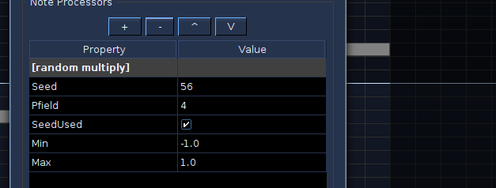

# Random Multiply Processor



Parameters: pfield, min, max

The RandomMultiplyProcessor takes a pfield to apply the random multiply
to, as well as a min and max for the boundaries of the random values.
When applied, it will multiply a random value for each note in the
assigned pfield, using a new random value per note.

The RandomMultiplyProcessor expects either a positive or negative float
value for the min and max, and a postive integer for the pfield. The
following score:

```csound-sco
i1 0 2 80
i1 + . 80
i1 + . 80
i1 + . 80
```

when processed with an RandomMultiplyProcessor with min set to 1.0, max
set to 2.0, and pfield set to 4, results in the following:

```csound-sco
i1  0.0 0.5 85.553246
i1  0.5 0.5 148.94167
i1  1.0 0.5 125.57565
i1  1.5 0.5 97.00755
```

(The p2 and p3 times above are post-processing for a 2 second duration
soundObject with time behavior set to scale.)

If seedUsed is set to "true", the random number generator will be
initialized using the given seed value. The seed value must be a valid
long integer value (-2^63, 2^63-1).

The above is an example of random values, and because it is random, the
results will be different on another processing pass.
