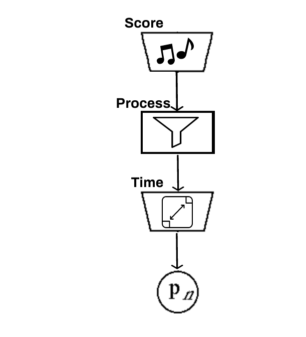
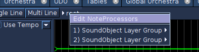
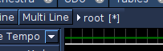

# NoteProcessors

## Introduction

NoteProcessors are used in conjunction with soundObjects, and are used
post-generation of the soundObject's noteList. They are used to modify
values within the noteList.

NoteProcessors can be added via the soundObject property dialog. When a
soundObject is selected on the timeline, and if the soundObject supports
noteProcessors, you can add, remove, push up, or push down
noteProcessors on the property dialog.

NoteProcessors may also be applied to layers to process all notes generated 
by a SoundObject layer. 

## Role in Score Generation

NoteProcessors are applied after the notes of the soundObject are
generated and before time behavior is applied. Processing starts with
the first NoteProcessor in the chain and the results of that are passed
down the chain.

## Note Processors windows on several levels

Note Processors are available on different levels in the Score. 

- rigth clicking on 'root' opens a Note Processor window for the entire score

    

- rigth clicking on 'root/SoundObject Layer Group' opens a Note Processor 
    window for that ScoreObject Layer Group
 
    if a Note Processor is present on a ScoreObject Layer Group, an asterix is 
shown.

    

- a Note Processor for the individual Layer by pressing the 'N' button of
that Layer

- a Note Processor can but put on most ScoreObjects by adding the
Note Processor in the ScoreObject Properties

- if the ScoreObject is a PolyObject; the PolyObject itself can have
Note Processors, but also most ScoreObjects inside the PolyObject.

     

    An asterix is shown to indicate an active Note Processor.
    
    
    
A tutorial video on NoteProcessors can be found here:
<https://www.youtube.com/watch?v=CS3Fszd460w> 
