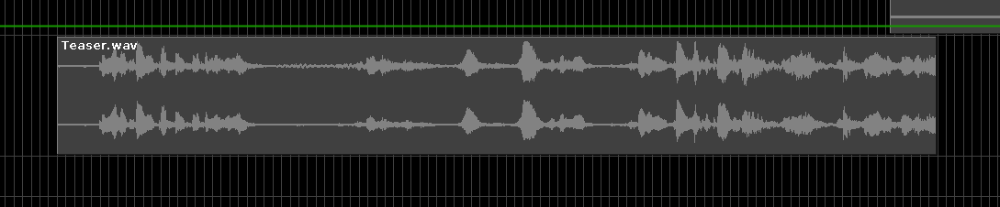

# AudioFile

Accepts NoteProcessors: no

Allows for quickly putting in a soundfile on the timeline.

Advised is to make use of the Audio Layer system, which 
offers much more flexibility in features like applying fades
and changing start time of the audio.
