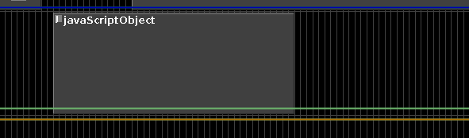

# JavaScriptObject

## Introduction

Accepts NoteProcessors: yes



Allows for the use of the JavaScript programming language to create
score data. Uses the built-in JavaScript interpreter (Nashorn) to
interpret JavaScript scripts.

After writing your script to generate notes, you'll have to bring back
into Blue by assigning the variable 'score' the text string of the
generated JavaScript score.

## Example

```javascript
function myScoreGenerator() {
   //code for generating score
   returns scoreText;
}
...
            
score = myScoreGenerator();
```

(where myScoreGenerator() is a function that will generate Csound SCO)
