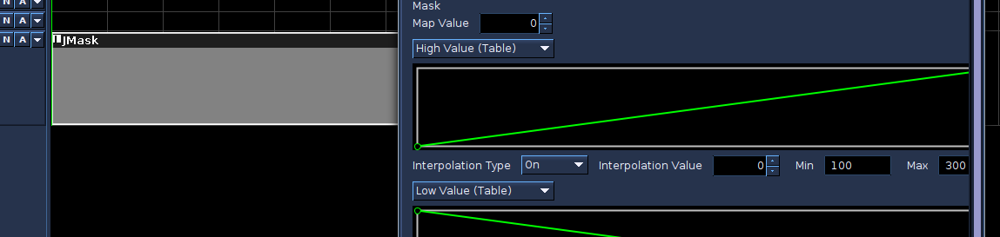
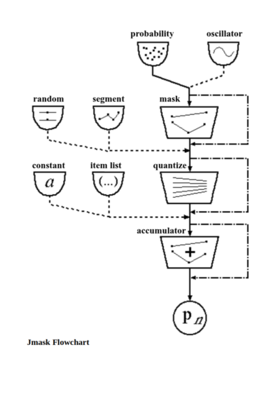
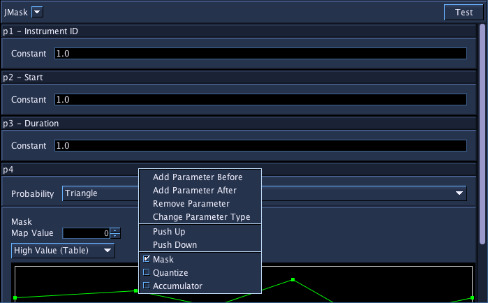
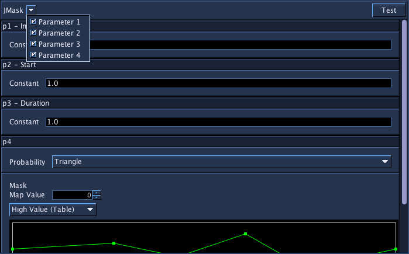
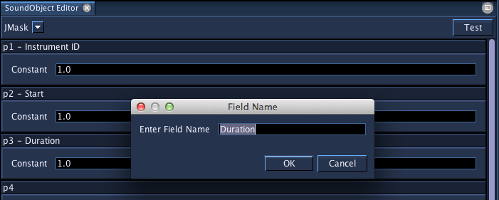

# JMask

## Introduction

Accepts NoteProcessors: yes

JMask is GUI score generating soundObject based on Andre Bartetzki's
[CMask](http://www.bartetzki.de/en/software.html). JMask currently
supports all features of CMask except field precision, though support
for this feature is planned. Users of JMask are encouraged to read the
CMask manual available at Andre Bartetzki's site to get familiar with
CMask concepts as they are represented 1:1 in JMask.

JMask builds on top of CMask's concepts and feature set by providing the
user a graphical way to edit parameter values, tables, masks, etc. Also,
by using JMask, the user's projects are guaranteed to run on all Blue
installations, while using CMask from Blue requires anyone opening and
using the project to have CMask installed on their system.

The following documentation for JMask will assume the user is familiar
with CMask and that the user has read through the CMask manual available
from the link above. The following will discuss how to use JMask,
covering how the CMask features are implemented in JMask and how to work
with the user interface. Over time, this manual entry for JMask will
attempt to grow to be self sufficient and not require knowledge of
CMask, but for now familiarity with CMask is suggested.

## Overview

A single JMask object is equivalent to one CMask field. A single JMask
object holds a collection of Parameters, one for each pfield to be
generated in the score. Each of the Parameter types in CMask is
available in JMask:

| Type        | Description                                                                                                                                                                                                                                                                                                       |
| ----------- | ----------------------------------------------------------------------------------------------------------------------------------------------------------------------------------------------------------------------------------------------------------------------------------------------------------------- |
| Constant    | Generate the given value when generating values for notes                                                                                                                                                                                                                                                         |
| Item List   | Generates values from a list of values given by the user. Options for generation include cycling through the list (cycle), going backwards and forwards through the list (swing), going through the list in random order using all values once before repeating (heap), and choosing a random list item (random). |
| Segment     | Generates values along a user-defined line.                                                                                                                                                                                                                                                                       |
| Random      | Generates a random value.                                                                                                                                                                                                                                                                                         |
| Probability | Generates a randomized value that is weighted by the given probability type and the configuration of the parameters of that probability type.                                                                                                                                                                     |
| Oscillator  | Generates values that oscillate in a given period using different user-chosen shapes.                                                                                                                                                                                                                             |

Beyond the Parameters, JMask supports the three modifier types found in
CMask: Masks, Quantizers, and Accumulators. Certain parameters support
different modifiers, and their support by paramater type is listed
below:

| Type        | Supports Mask | Supports Quantizer | Supports Accumulator |
| ----------- | ------------- | ------------------ | -------------------- |
| Constant    | No            | No                 | Yes                  |
| List        | No            | No                 | Yes                  |
| Segment     | No            | Yes                | Yes                  |
| Random      | No            | Yes                | Yes                  |
| Probability | Yes           | Yes                | Yes                  |
| Oscillator  | Yes           | Yes                | Yes                  |

JMask also supports the use of a seed value. When enabling the use of
seeding, the seed value will be used to initialize the pseudo-random
number generator used in randomized operations. This allows the user to
set a seed and get consistently reproducible results. The default is to
use the system time to seed the random number generator, thus giving
different results each render. Seeding values may be a long (i.e, 64-bit)
integer value; for more information, see the documentation for Java's
[Random](https://docs.oracle.com/javase/8/docs/api/java/util/Random.html#Random-long-)
class.

## Using the JMask Interface

The JMask SoundObject Editor allows for viewing the editors for all of
the assigned parameters. Parameters are each set to generate values for
one pfield. On the top side of each row is the Parameter Edit Panel.
This panel shows a number at the top that corresponds to what pfield
this parameter will generate values for, as well as the field name. To
change things about the Parameter, right-click the panel to show a popup
menu as shown in the image above. The options are described below:

Add Parameter Before  
:   Create a new Parameter and insert it before the Parameter clicked on
    by mouse. When this option is selected, a dialog will appear with a
    dropdown of options of what type of Parameter to add.

Add Parameter After  
:   Create a new Parameter and insert it after the Parameter clicked on
    by mouse. When this option is selected, a dialog will appear with a
    dropdown of options of what type of Parameter to add.

Remove Parameter  
:   Remove this Parameter. Will not be allowed if trying to edit
    parameters 1-3 as JMask requires a minimum of 3 pfields.

Change Parameter Type  
:   Choose a different type of Parameter and replace the current one
    with the selected one. Any edits from the old Parameter will be lost
    once a new parameter type is chosen.

Push Up  
:   Move the selected Parameter to before the previous Parameter.
    Example: Push up parameter at pfield 5 to pfield 4, moving what was
    previously at 4 to 5.

Push Down  
:   Move the selected Parameter to after the next Parameter. Example:
    Push down parameter at pfield 4 to pfield 5, moving what was
    previously at 5 to 4.

Mask  
:   Enable/disable using a Mask with this parameter. If enabled, the
    Mask editor will appear, and if disabled, the Mask editor will
    disappear. This menu option will not show for those Parameters that
    do not support Masks.

Quantizer  
:   Enable/disable using a Quantizer with this parameter. If enabled,
    the Quantizer editor will appear, and if disabled, the Quantizer
    editor will disappear. This menu option will not show for those
    Parameters that do not support Quantizers.

Accumulator  
:   Enable/disable using an Accumulator with this parameter. If enabled,
    the Accumulator editor will appear, and if disabled, the Accumulator
    editor will disappear. This menu option will not show for those
    Parameters which do not support Accumulators.

Beyond the basics of moving around Parameters, adding new ones, and
choosing whether to enable Masks, Quantizeres, and Accumulators, one can
also choose to show/hide Parameters by using the popup menu that appears
when choosing the down arrow button in the JMask title bar, as shown in
the screenshot below.

To edit the field name, double click the Parameter Edit Panel. A dialog
will appear where you can modify the field name, as shown below:

Beyond these basics for working with the Parameters in general, each
Parameter type has its own editor, each customized for the values and
options allowable for each Parameter. Currently, documentation is
omitted for each Parameter's GUI as they correspond in feature and
parameters as CMask, and the user is encouraged to consult the CMask
manual for more information on editing each Parameter.

_A tutorial video on JMask can be found [here](https://www.youtube.com/watch?v=CS3Fszd460w)._

