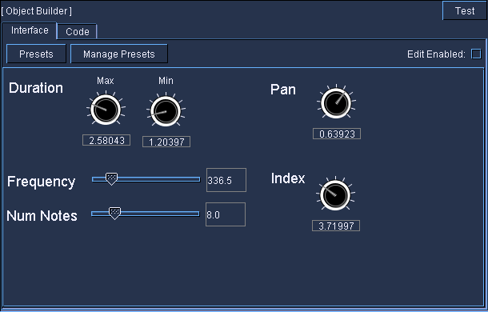
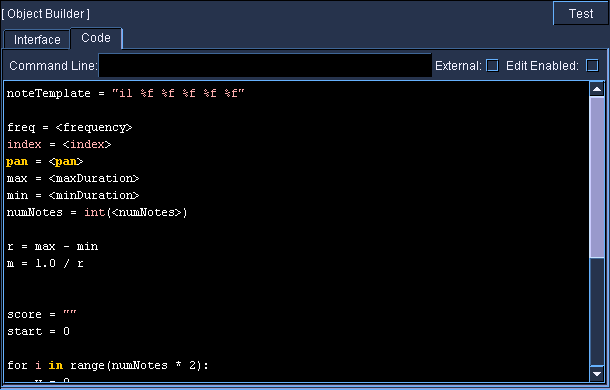

# ObjectBuilder

Accepts NoteProcessors: Yes

This SoundObject allows users to build their own SoundObjects by using
the same widgets and features as the
[BlueSynthBuilder](../../instruments/blueSynthBuilder) for creating user interfaces, as
well as using either Python script or External Script for the score
generation. When generating score, the script has token values replaced
by values from the user interface before generating. The scripts
generated in the same manner as the [PythonObject](../pythonObject) and as
the [ExternalObject](../external) .

!!! note
    The code completion feature using ctrl-shift-space for values from
    the UI that is available in BlueSynthBuilder is also available in this
    SoundObject.

