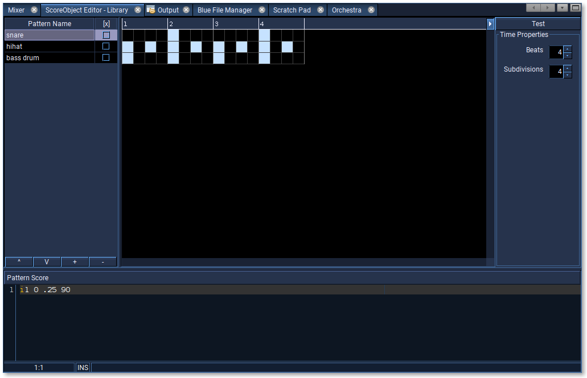

# PatternObject

## Introduction

Accepts NoteProcessors: yes


The PatternObject is pattern-based score editor, based on the author's
previous project "Patterns". It is a flexible pattern-oriented score
editor, useful for musical ideas which are pattern based, such as drum
parts or minimalist-style musical ideas.

## Usage

For the general workflow of using the PatternObject, users will liked
likely want to:

1.  Setup the PatternObject Properties (number of beats and
    subdivisions)

2.  Add Patterns, giving each pattern a name to help identify what the
    pattern is for

3.  Edit each Pattern's score

4.  Visually edit the PatternObject score

 Setting PatternObject Properties

The PatternObject's Time Properties can be modified by clicking on the
button in the upper-right corner of the editor. Clicking the button will
hide or show the properties panel on the right, as shown below:



!!! note
    Editing the time values will clear out any pattern triggers that the
    user has entered. It is recommended that one first decide the pattern
    time properties before working with the PatternObject.

##  Adding Patterns

To add Patterns to the PatternObject, use the "+" button on the bottom
of the left hand section. Double-clicking the name of the pattern name
will allow editing of the name, and clicking on the \[x\] box will allow
for muting the Pattern. Clicking on the Pattern in the table will also
bring up it's score in the area below.

##  Editing the Pattern's Score

The Pattern's score is standard Csound SCO text, with the same features
supported as by the GenericScore SoundObject. Each score should be
started from time zero. The Pattern's score should be set such that its
score's total duration fits within the time of the subDivision. For
example, if the properties set for the PatternObject's time values are 4
beats and 4 subdivisions, each beat is 1.0 in duration (corresponds to
p3 value of a note) and thus a single subdivision in this case would be
equivalent to .25. Scores shorter or longer than the subdivision length
are allowed, but one should be aware that the resultant score may or may
not longer than what is visually represented on the PatternObject score.

##  Editing the PatternObject Score

The PatternObject score is visually edited by click on squares which
correspond to subdivisions of the beat. For example, if a Pattern's
score is .25 in total duration, and the time value of the PatternObject
is set to 4 and 4, then clicking a square would be to insert a 16th note
in a score.

To add to the PatternObject score, simply click on the square where one
wishes to have a Pattern triggered. To remove, simply click on a
selected square. The user can also click and drag to add or remove
mutliple triggers.

## Other Notes

  - Users may be surprised at the generated score if time behavior is
    not set to None(while others may prefer to use Scale, which is the
    default). Please be mindful of this, especially when using
    PatternObjects and the SoundObject library, where the default for
    creating instances of SoundObjects is to have Time Behavior of Scale
    on the Instance SoundObject.

  - When the PatternObject is used with a Scale time behavior, you may
    not get the results you think you will get if the pattern is not
    filled in in the last subdivision of the beat. When Blue goes to
    generate a score for a soundObject, with a scale time behavior, the
    score is first generated, then scaled to the duration of the
    soundObject. So, if you're pattern has empty subdivisions and you're
    expecting there to be a space at the end of your pattern, when you
    go to generate the CSD, the space won't be there.
    
    To get around this, you may want to use a time behavior of None, or
    you may want put in a "ghost note" in a Pattern layer, using a note
    like:
    
    ```
    i 10000 0 .25
    ```
    
    Where 10000 is not an instrument in use in your project. Then you
    can put in a trigger for this pattern in the last subdivision. What
    will happen is that Blue will process the score with this note's
    time and thus will generate with this out to the CSD, but Csound
    will ignore the note.
    
    When the PatternObject is set to use a time behavior of Repeat, the
    same situation can occur as when using Scale if a Repeat Point is
    not set, as the default for Repeat when no repeat point is set is to
    take the generated score and repeat it after the duration of the
    last note. To prevent this, either use the ghost note technique
    above or set a repeat point.

_A tutorial video on the PatternObject can be found 
[here](https://www.youtube.com/watch?v=O2QkPMP0Rrc&t=319s)._

