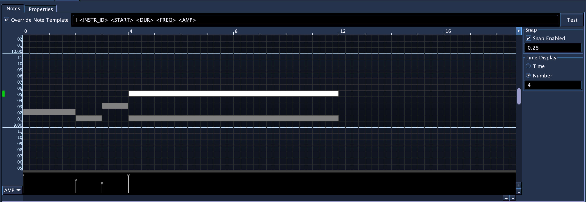

# PianoRoll

## Introduction

Accepts NoteProcessors: yes



The PianoRoll SoundObject is a graphical tool for quickly drawing in and
editing notes.  Blue's PianoRoll is unique from those found in other DAWs in
two ways. Firstly, as Csound's note system is user-extensible (i.e., users may
define the number of pfields for their instrument), Blue's PianoRoll allows for
customization for any number of pfields per note.  Secondly, Blue's PianoRoll
is Microtonal and supports loading any
[Scala](http://www.huygens-fokker.org/scala/) scale file and editing of notes
adapts to that scale. (The PianoRoll is pre-set to use 12-TET
tuning by default, which should cover most use cases out of the box.) 
 The generated notes can output values as either frequency, Blue PCH notation
(octave.scaleDegree) or MIDI note numbers. 

## General Usage

The general workflow for the PianoRoll is as follows:

1. Create a PianoRoll Object
2. Configure the PianoRoll for your instrument. This involves editing the instrument number, 
tuning, scale, pitch generation method, and adding any additional fields for notes. The PianoRoll 
has defaults that generate for frequency as p4 and amplitude in range 0.0-1.0 for p5.
3. Draw in and edit notes. Edit fields for notes.
4. Make copies of the configured PianoRoll to use as a template for new musical material. 


##  Configuring Piano Roll Properties

### PianoRoll Properties

The PianoRoll requires configuration before using. The
properties page below shows the properties that should be configured
before using the actual note drawing canvas.


Instrument ID  
:   Instrument name or number to be used when replacing <INSTR\_ID\> in
    Note template strings.

Note Template  
:   The default note template when inserting notes. Each note will 
    use the default template for the PianoRoll unless the user has 
    elected to have a specific note use its own template. 
    Generally, you'll want to create a template
    string that will match the instrument this PianoRoll will be used
    with.

Scale  
:   The scale used with this PianoRoll. The PianoRoll defaults to a
    12-TET scale, the "standard" scale in use in Western classical and
    popular music. Pressing the button labeled "..." will open a file
    browser for selecting Scala scale files to use in place of the default.
    After selecting a scale, the PianoRoll will adjust the note canvas
    for the number of scale degrees the newly selected scale contains.

Base Frequency  
:   The base frequency of the scale for octave 8 and scale degree 0
    (8.00). Defaults to C below A440.

Pch Generation  
:   Selects how the notes will generate their value to be used when
    replacing the <FREQ\> tag value in a note template. The options
    are:
    
    Frequency  
    :   The value of the note's pitch expressed in terms of frequency in
        hertz. This value is calculated using the chosen Scale for the
        PianoRoll.
    
    Blue PCH  
    :   Value of note expressed in Blue PCH, a format similar to Csound
        PCH but differs in that it does not allow fractional values.
        Values are generated as "octave.scaleDegree" i.e. "8.22" would
        be octave 8 and scale degree 22 in a scale that has 23 or more
        notes, or would wrap around as it does in Csound PCH. If the
        scale had 12 scale degrees, the "8.22" would be interpreted as
        "9.10". Blue PCH is allowed as an option to be used with Blue
        PCH note processors and then to be used with the Tuning
        NoteProcessor.
    
    MIDI  
    :   When this Pch Generation method is chosen, a MIDI note value
        (0-127, 60 = Middle-C) is used for <FREQ\> and the chosen Scale
        will not be used. The display for the editor will automatically
        switch to show octaves and notes for standard MIDI scale values.
        Using MIDI note values is useful for instruments that exepct
        MIDI note values such as the fluidsynth opcodes as well as
        midiout.

    Transposition
    :   Simple tool to transpose all notes within the PianoRoll by a given
        number of scale degrees.

    Additional Fields
    :   User-definable set of additional fields per note. Use the editor to 
        add or remove fields, edit the field name, type (DISCRETE or CONTINUOUS, 
        meaning it only permits whole numbers or allows for decimal numbers), 
        a min and max value, as well as default value to use for new notes. 
        The name of each field is used in the template string to replace the 
        named template key with the value from the note. For example, if a field has 
        a name of AMP, any instance of <AMP\> in the template string will be replaced 
        with the value from the AMP field from the parameter editor for that note.

###  Further information on Note Template Strings

The PianoRoll uses Note Template strings as a way to maintain
flexibility and be able to handle the open-ended nature of Csound's
instruments. Since the user who builds the instrument designs what each
pfield will mean (with the exception of p1, p2, and p3), the Note Template string
should be made to match the instrument the user wants to use the
PianoRoll with. When the PianoRoll generates Csound Score data, certain template strings 
(those enclosed in < and \>) will be replaced by values unique to the
note.

For example, the following Note Template string:

``` 
      i<INSTR_ID> <START> <DUR> <FREQ> 0 1 1
```

Will have the <INSTR\_ID\> replaced with the value set in the Piano
Roll properties, <START\> replaced the start time for the note, <DUR\>
replaced with the duration of the note, and <FREQ\> replaced with
either a frequency, PCH, or MIDI note number value, depending on how the Piano Roll is
configured in its properties. The other values will pass through as part
of the note.

!!! warning
    Caution should be used when creating a Note Template string to make sure
    that there are enough spaces allowed between replacement strings. For
    example, the following:

    ``` 
    i<INSTR_ID> <START> <DUR> <FREQ> <FREQ> 0 1 1
    ```

    would result in:

    ``` 
    i1 0 2 440 440 0 1 1
    ```

    while the following:

    ``` 
    i<INSTR_ID> <START> <DUR> <FREQ><FREQ> 0 1 1
    ```

    which does not have proper space between the two <FREQ\> tags, results
    in:

    ``` 
    i1 0 2 440440 0 1 1
    ```

### Time Options

The Time Options for the PianoRoll are available on the Notes page. The button
labelled "..." in the upper right corner of the PianoRoll canvas will
open and close the panel on the right that contains the properties.

Snap Enabled  
:   Enables snapping behavior on the timeline. If enabled, vertical
    lines will be drawn at snap points, set by the value below it. In
    the screenshot above, the snap is enabled and set to every 0.25 
    beats.

Time Display  
:   Controls how the time in the time bar above the PianoRoll canvas
    will display. The time value will show as time, while Number display
    will display as integers. The number below show how often to put a
    label. In the screenshot above, the Time Display is set to show a
    label in units of numbers and at every 4.0 beats.

## Editing Notes

To enter notes, hold down the shift key and press the left mouse button
down on the canvas. A note will be entered where you pressed and will be
set to resize as you move the mouse around. Insertion of the note ends 
when you release the mouse button.

Beyond drawing in notes, you may also select notes by clicking on them or drag and
selecting notes by marquee. You may also press the shift key and click
on notes to add to the currently selected notes. You can then drag the
notes around by click a selected note and dragging. To resize a note,
hover over the edge of one of the selected notes (the mouse cursor will change to a resize cursor),
click, then drag to resize the selected notes.

You may also cut or copy and paste notes by:

1. Select a set of notes
2. Press ctrl-c (cmd-c on macOS) to copy the notes (or use ctrl-x or cmd-x to cut)
3. Hold down ctrl and click with the mouse where you would like to paste 
   the notes.

To remove a note or notes, select the notes, then press the delete key.

To override a note's template, select a single note. After selecting a note,
the text field for the note's template text will be shown at the top of the Notes editor. 
Select "Override Note Template" and edit the note template for that individual note.

### Field Values

Additional Fields configured in the PianoRoll appear as graphically editable values in the area below
the PianoRoll Note Canvas. The dropdown on the left-hand side allows for switching what active field is being 
edited for notes.  Newly-created notes will have field values set to the default value configured for each field definition. To change field values for notes, first select some notes then either:

1. Use the handles in the field editor to drag up and down to edit the field values, or
2. Press ctrl (or cmd on macOS), hover over one of the selected notes on the canvas, then click and drag up/down to edit the field values. (The mouse cursor should change into a horizontal resize cursor when hovering over a selected note with ctrl/cmd down.) 

Note that when editing field definitions in the PianoRoll properties for PianoRolls with existing note data, the following occurs:

* Renamed fields retain their data values
* If min or max changes, values for fields will be clamped between the new min and max values.
* If a field definition is removed, the field data for notes will be removed
* If a new field is added, notes will all get a new field value set the default value for that field definition. 

## Additional Information

!!! note "For more Information"

    See the example .blue file in the blue/examples/soundObjects folder.

