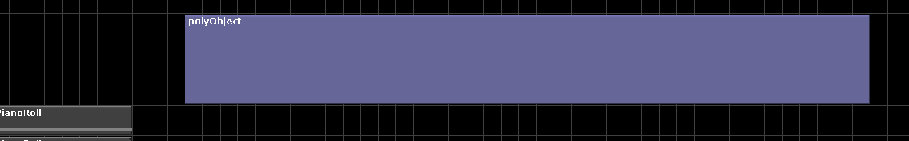
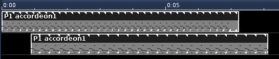
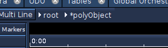

# PolyObject

Accepts NoteProcessors: yes

A timeline object that acts as a container for other SoundObjects.
PolyObjects can also be embedded within each other.

!!! tip "Try This"

    On the root timeline, rt-click on a soundLayer and select "Add new
    PolyObject". You should have added a new PolyObject to the timeline. Now
    either double-click or rt-click on the PolyObject and select "Edit
    SoundObject". You should now be within the PolyObjects timeline, and the
    button which says \[root\] should now have another button next to it
    that says \[PolyObject\]. Now try adding a few soundLayers and a few
    GenericScore Objects. Now click on \[root\]. You have now returned to
    the root timeline. Here you should see the PolyObject you've edited. Now
    you can scale the object you've created and all of the objects held
    within will scale together as a group.

When converting Object(s) to a PolyObject, a warning appears:"This operation
can not be undone. Are you sure?" Why this warning?
Once Object(s) are converted to PolyObjects, there is no way back; Note 
Processors that are put on this PolyObject would be lost and the information 
how objects within the polyObject were mapped on the layers in the root or 
parent polyObject is not known.

The way to recover the Objects in the polyObject and their relative positions, 
would be to copy these Object(s) and paste them in the main Score editor.

All Parameter automation information used on the polyObject will be lost. 

If the PolyObject has noteprocessors on it, it gives the asterisk.  
You can add noteprocessors to the root timeline for example. It is a way 
to differentiate that a NoteProcessor was present for that situation.

